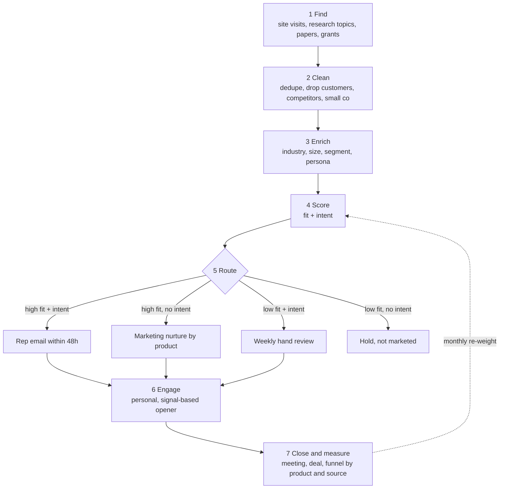
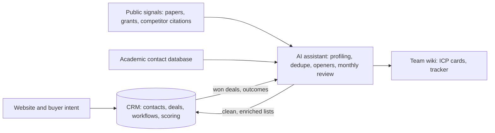

# Lead journey: signal to sale in seven steps

```mermaid
flowchart TD
    A[1 Find<br/>site visits, research topics, papers, grants] --> B[2 Clean<br/>dedupe, drop customers, competitors, small co]
    B --> C[3 Enrich<br/>industry, size, segment, persona]
    C --> D[4 Score<br/>fit + intent]
    D --> E{5 Route}
    E -->|high fit + intent| F[Rep email within 48h]
    E -->|high fit, no intent| G[Marketing nurture by product]
    E -->|low fit + intent| H[Weekly hand review]
    E -->|low fit, no intent| I[Hold, not marketed]
    F --> J[6 Engage<br/>personal, signal-based opener]
    G --> J
    H --> J
    J --> K[7 Close and measure<br/>meeting, deal, funnel by product and source]
    K -.->|monthly re-weight| D
```

## Tool map (one tool per stage)

```mermaid
flowchart LR
    CRM[(CRM: contacts, deals, workflows, scoring)]
    SIG[Public signals: papers, grants, competitor citations]
    INT[Website and buyer intent]
    DB[Academic contact database]
    AI[AI assistant: profiling, dedupe, openers, monthly review]
    WIKI[Team wiki: ICP cards, tracker]
    SIG --> AI
    DB --> AI
    INT --> CRM
    AI -->|clean, enriched lists| CRM
    CRM -->|won deals, outcomes| AI
    AI --> WIKI
```
