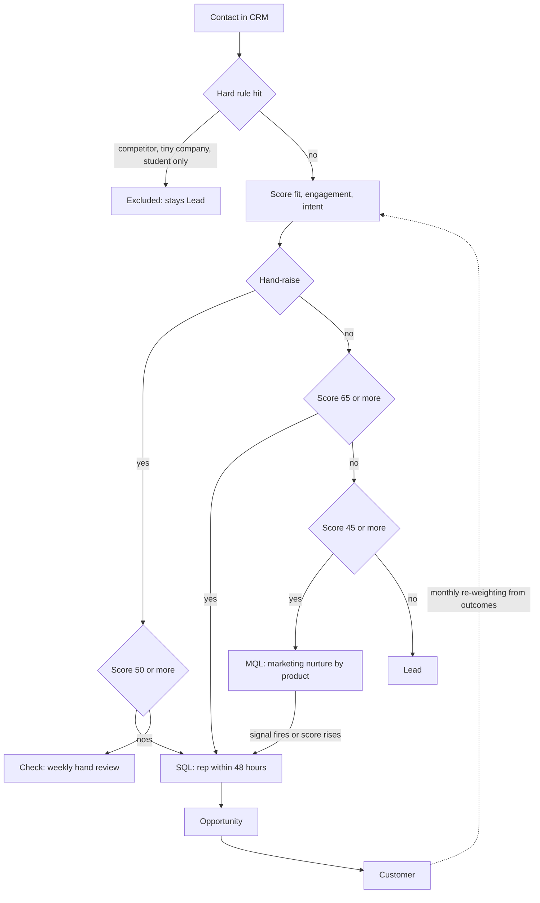

# New lifecycle flow

```mermaid
flowchart TD
    A[Contact in CRM] --> B{Hard rule hit}
    B -->|competitor, tiny company, student only| X[Excluded: stays Lead]
    B -->|no| C[Score fit, engagement, intent]
    C --> D{Hand-raise}
    D -->|yes| E{Score 50 or more}
    E -->|yes| SQL[SQL: rep within 48 hours]
    E -->|no| CHK[Check: weekly hand review]
    D -->|no| F{Score 65 or more}
    F -->|yes| SQL
    F -->|no| G{Score 45 or more}
    G -->|yes| MQL[MQL: marketing nurture by product]
    G -->|no| L[Lead]
    MQL -->|signal fires or score rises| SQL
    SQL --> OPP[Opportunity]
    OPP --> CUS[Customer]
    CUS -.->|monthly re-weighting from outcomes| C
```
