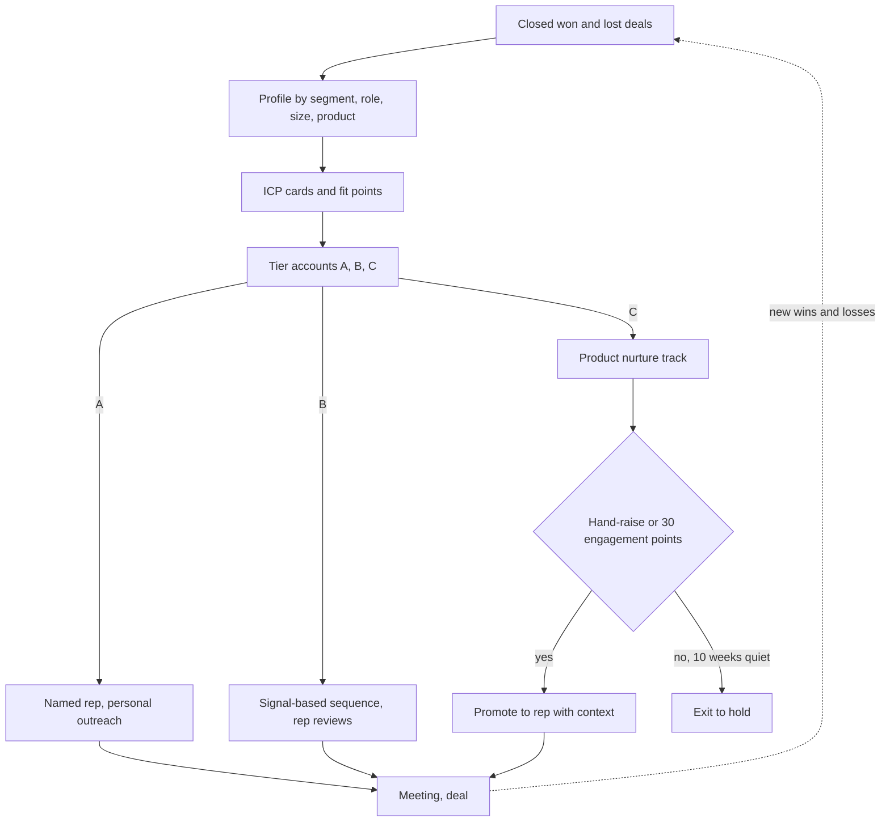

# From won deals to nurture

```mermaid
flowchart TD
    A[Closed won and lost deals] --> B[Profile by segment, role, size, product]
    B --> C[ICP cards and fit points]
    C --> D[Tier accounts A, B, C]
    D -->|A| E[Named rep, personal outreach]
    D -->|B| F[Signal-based sequence, rep reviews]
    D -->|C| G[Product nurture track]
    G --> H{Hand-raise or 30 engagement points}
    H -->|yes| I[Promote to rep with context]
    H -->|no, 10 weeks quiet| J[Exit to hold]
    I --> K[Meeting, deal]
    E --> K
    F --> K
    K -.->|new wins and losses| A
```
