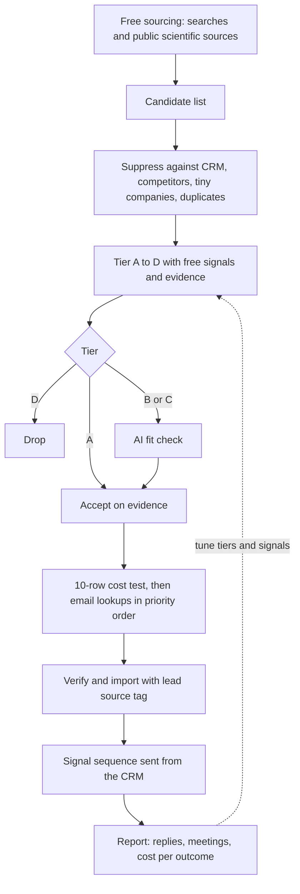

# Pilot funnel

```mermaid
flowchart TD
    A[Free sourcing: searches and public scientific sources] --> B[Candidate list]
    B --> C[Suppress against CRM, competitors, tiny companies, duplicates]
    C --> D[Tier A to D with free signals and evidence]
    D --> E{Tier}
    E -->|D| X[Drop]
    E -->|A| F[Accept on evidence]
    E -->|B or C| G[AI fit check]
    G --> F
    F --> H[10-row cost test, then email lookups in priority order]
    H --> I[Verify and import with lead source tag]
    I --> J[Signal sequence sent from the CRM]
    J --> K[Report: replies, meetings, cost per outcome]
    K -.->|tune tiers and signals| D
```
