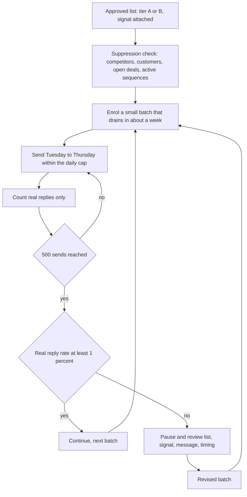

# Send discipline

```mermaid
flowchart TD
    A[Approved list: tier A or B, signal attached] --> B[Suppression check: competitors, customers, open deals, active sequences]
    B --> C[Enrol a small batch that drains in about a week]
    C --> D[Send Tuesday to Thursday within the daily cap]
    D --> E[Count real replies only]
    E --> F{500 sends reached}
    F -->|no| D
    F -->|yes| G{Real reply rate at least 1 percent}
    G -->|yes| H[Continue, next batch]
    G -->|no| I[Pause and review list, signal, message, timing]
    I --> J[Revised batch]
    J --> C
    H --> C
```
