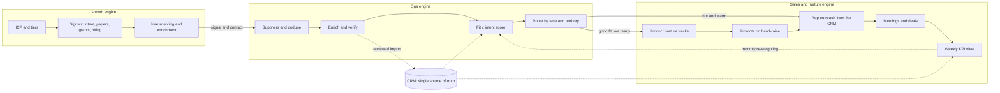

# Target GTM system

```mermaid
flowchart LR
    subgraph G[Growth engine]
      G1[ICP and tiers] --> G2[Signals: intent, papers, grants, hiring] --> G3[Free sourcing and enrichment]
    end
    subgraph O[Ops engine]
      O1[Suppress and dedupe] --> O2[Enrich and verify] --> O3[Fit x intent score] --> O4[Route by lane and territory]
    end
    subgraph S[Sales and nurture engine]
      S1[Rep outreach from the CRM]
      S2[Product nurture tracks]
      S3[Promote on hand-raise]
      S4[Meetings and deals]
      S5[Weekly KPI view]
    end
    G3 -->|signal and contact| O1
    O4 -->|hot and warm| S1
    O4 -->|good fit, not ready| S2
    S2 --> S3 --> S1
    S1 --> S4 --> S5
    S5 -.->|monthly re-weighting| O3
    CRM[(CRM: single source of truth)]
    O2 -.->|reviewed import| CRM
    CRM -.-> O3
    CRM -.-> S5
```
